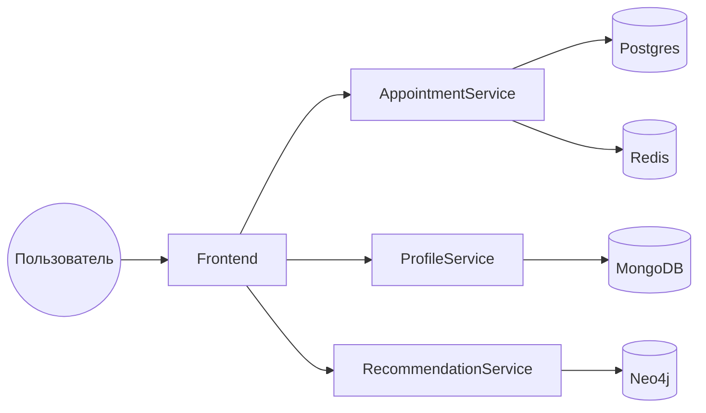

# VET CLINIC

## Описание проекта
🐾 Vet Clinic — учебный микросервисный проект, представляющий собой сайт для ветеринарной клиники. Сайт позволяет управлять:
 - профилями питомцев (есть возможность создания профиля питомца с указанием вида, возраста и имени)
 - записями на приём к ветеринару
 - рекомендациям по уходу или по корму для конкретных видов животных

## Стек технологий
- **Backend:** Java, Spring Boot, Redis, REST API, Postgres, MongoDB, neo4j 
- **Frontend:** React.js, JavaScript, HTML, CSS
- **DevOps:** Docker, Docker Compose, Git
- **Прочее:** Postman (тестирование API), Swagger (документация API)

## Команда и роли
- **Giro (Я):** Архитектура проекта, Open API, разработка сервиса записи Appointment Service, контейнеризация, последующая доработка
- **Elics21:** Frontend, дизайн интерфейса, интеграция с API
- **AppleMic:** Разработка сервиса профилей Profile Service
- **Harakki:** Разработка сервиса рекомендаций Recommendation Service, рефакторинг

## Особенности реализации
- Микросервисная архитектура: каждый сервис отвечает за свою область (профили, приёмы, рекомендации и т.д.)
- Взаимодействие сервисов через REST API
- Контейнеризация всех компонентов для удобного развертывания
- Документирование API с помощью Swagger

 ### Структура проекта

```text
VetClinic/
├── appointments-service/   # сервис записи к врачу
├── profile-service/        # сервис профилей питомцев
├── recommendation-service/ # сервис рекомендаций
├── frontend/               # React-приложение
├── docker-compose.yaml
└── README.md
```

### Архитектура проекта


### Appointments Service
- Использование Postgres для хранения информации о докторах, их расписании и записях к ним
- Кеширование информации из предыдущего пункта с помощью Redis для быстрого доступа к часто используемым данным

### Profile Service
- Использование MongoDB для хранения данных о профилях питомцев
- Взаимодействие с сервисом рекомендаций для обработки питомцев

### Recommendation Service
- Использование графовой БД Neo4j для хранения информации о рекомендациях по уходу или по корму для питомцев
- Автоматическое предложение рекомендаций при создании питомца определенного вида

## Как запустить приложение

### Локальный запуск (без контейнеров)
1. Установите Java 21+, Node.js
2. Запустите backend сервисы: Appointments, Profile, Recommendation из соответствующих директорий, предварительно вернув зависимость к их ```compose.yaml``` в ```applicaction.properties```
3. Запустите frontend:
    ``` bash
    cd FrontEnd
    npm install
    npm start
    ```
4. Откройте http://localhost:3000 в браузере.

### Запуск в контейнерах (Docker)
1. Установите Docker
2. Выполните команду 
    ``` bash
    docker compose up --build
    ```
3. Откройте http://localhost:3001 в браузере.

## Roadmap
- [ ] Сделать аутентификацию через Spring Security  
- [ ] Добавить Gateway сервис  
- [ ] Улучшить документацию  
- [ ] Оптимизировать под высокие нагрузки:  
  - [ ] Подключить Kafka для обмена сообщениями  
  - [ ] Расширить использование кеширования  
  - [ ] Провести рефакторинг кода  
